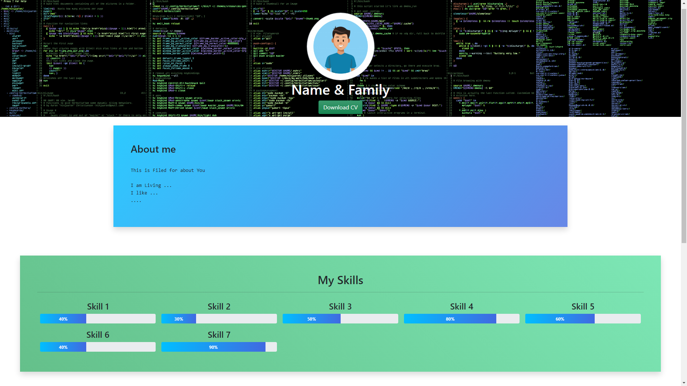
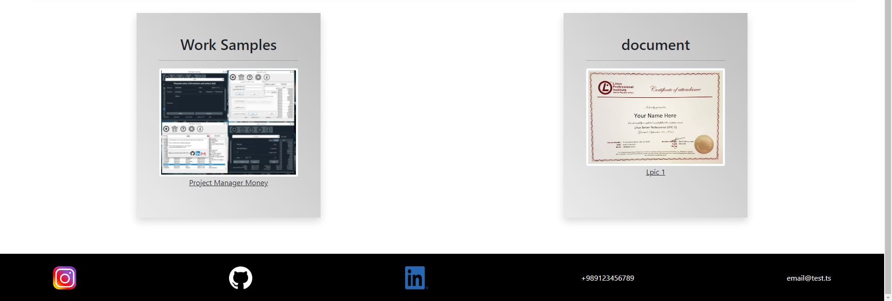
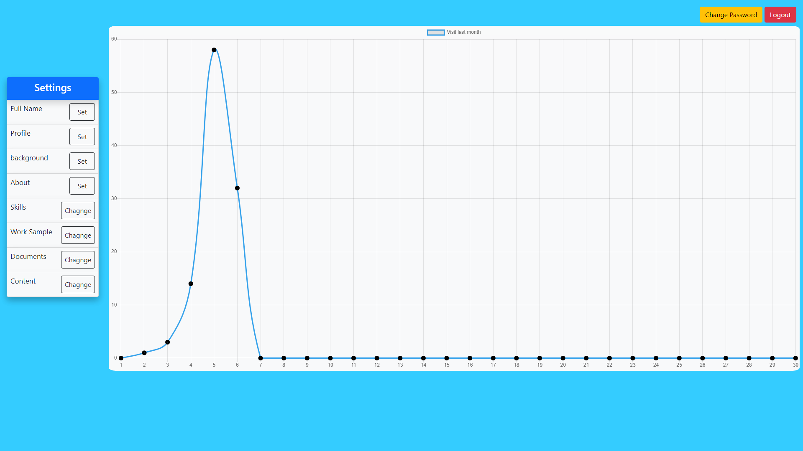
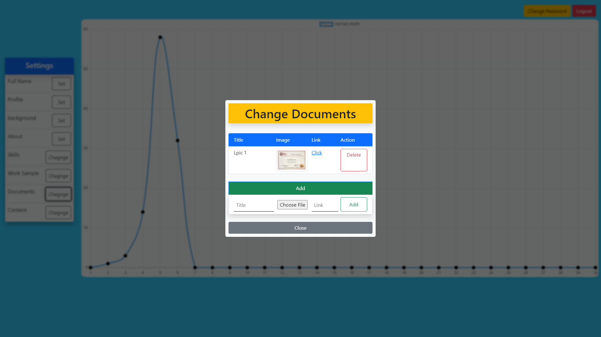

# Personal-Site
## Images from Web Application
### `Main Page`
- 
- 

### `Admin Panel`
- 
- 

## what is this ?
this is a Web Application with flask for Developers as Personal WebSite for CV's

## Requirements

- Use python3

- install sqlite3 ( [link](https://www.tutorialspoint.com/sqlite/sqlite_installation.htm) )

- install python packages

```
pip install -r requirements.txt
```

- Set value for Varibles in '.example.env' and chagne name it to '.env'

## Running
```
flask run
```
## Routes
`/` Main Page

`/admin` admin Page  

## login to panel admin
`user name : admin`

`password : admin`


## TODO
- [ ] Fix or Report Bugs
- [ ] Responsiv Ui